# ACNH BCAT activation guide
If you're new, please follow this guide step by step to prevent undesirable results, like losing your game progress.

## Index
* [Index](#index)
* [Guide](#guide)
  * [Summary](#summary)
  * [1. Download JKSV and switch-time](#1-download-jksv-and-switch-time)
  * [2. Create a savegame backup](#2-create-a-savegame-backup)
  * [3. Download and inject BCAT files](#3-download-and-inject-bcat-files)
  * [4. Sync time with switch-time homebrew](#4-Sync-time-with-switch-time-homebrew)
  * [5. Profit](#5-profit)
* [FAQ](#faq)
  * [Do I need my own passphrase.bin?](#do-i-need-my-own-passphrasebin)
* [Credits](#credits)

## Guide
### Summary
BCATs are needed to activate some special, time limited events in game.  
The guide shows you how to backup your game progress and inject right BCAT files into your game.  
Once you know how it works, you can repeat all steps for each new BCAT coming out.

### 1. Download JKSV and switch-time
Before we begin, we need right tools to backup savegame, restore BCAT and set synced time.  
1. Download latest [JKSV](https://github.com/J-D-K/JKSV/releases) version from the [release page](https://github.com/J-D-K/JKSV/releases).  
   The current version is from 4th April, but you should always prefer the latest one.
   
2. To download a file from a GitHub release, first of all expand "Assets", then in the most cases there is an nro file or an archive like a zip. In this case we need only the **JKSV.nro**.  
   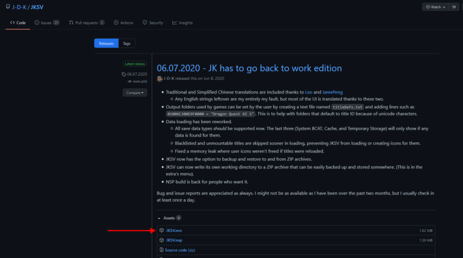
3. The same is for the [switch-time](https://github.com/3096/switch-time/releases) homebrew.
   Download the nro from the latest release.  
    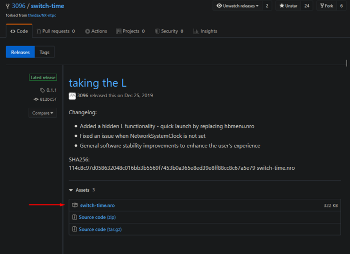
4. Now copy **JKSV.nro** and **switch-time.nro** to the switch directory on your sd card.  
   I'm using FTP and it looks like this.  
   Root of the sd card:  
   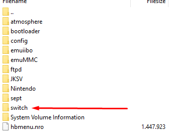  
   Switch directory:  
   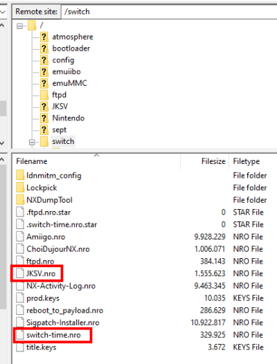

### 2. Create a savegame backup
This is the **most important** step! Nobody wants to lose his progress.

1. Open the Homebrew menu and start the [JKSV](https://github.com/J-D-K/JKSV/releases), that we have installed in the first step.  
   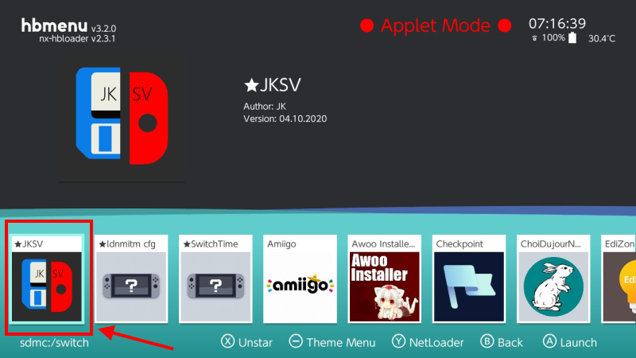
2. Navigate and open **Device Saves**.  
   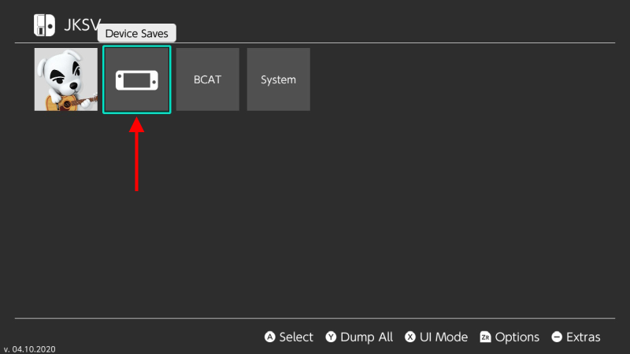
3. Now choose the game you want to backup.  
   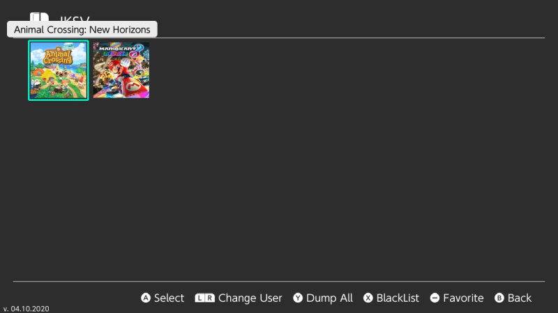  
4. Create a new savegame backup by choosing New and pressing the **A**-Button.
   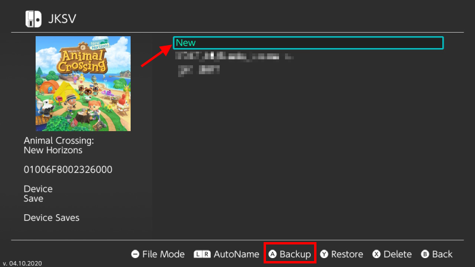
5. You have created a savegame from your game. I recommend you to make a backup copy of this save to your PC and maybe even better to a cloud service like Dropbox, Google Drive etc.  
   You can find the folder with your savegame on your sd card under:  
    `/JKSV/Animal Crossing  New Horizons/`, the whole folder named `Device Saves - (date @ time)` is your savegame.  
   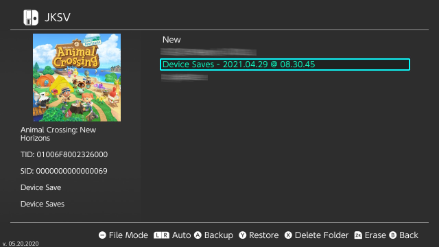
6. We are done here, if something bad happens, you can always restore this savegame file to restore your progress.

### 3. Download and inject BCAT files
Now we have to inject event BCAT files into the game.
  
1. Navigate to [releases](https://github.com/agronomru/ACNH-BCATs/releases) and download latest BCAT files release. It should be a zip file.  
   Note: The dump contains BCATs for the current/next and all previous events!  
   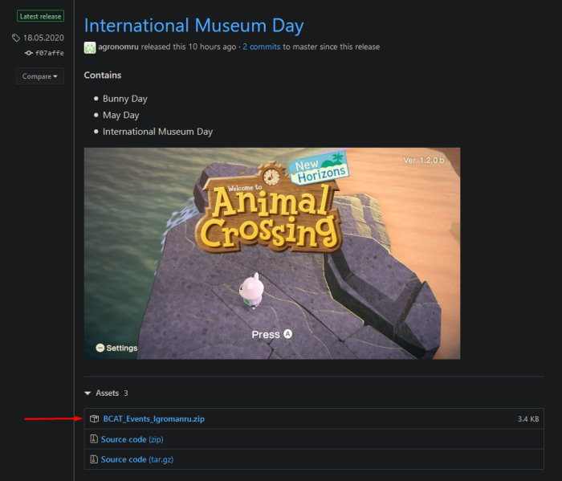
2. Unzip/extract the zip archive, you should have a folder now.  
   Note: Folder's name can be different, just make sure that inside the folder is at least another folder called `directories`.  
   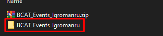
3. Copy the folder to the directory `/JKSV/Animal Crossing  New Horizons/` on your sd card.  
   It should looks like this:  
   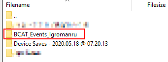
4. Now insert back the sd card, close FTP or whatever, then open JKSV in hbmenu.  
   
5. This time navigate to the **BCAT** section.  
   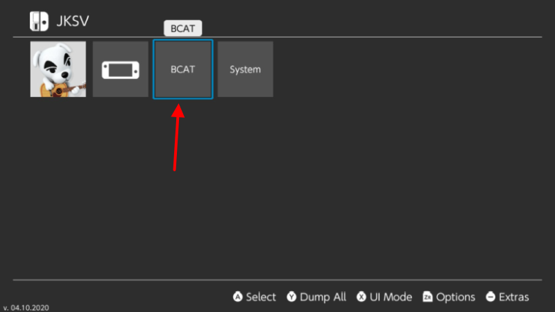
6. Double check that you're in **BCAT** menu.  
   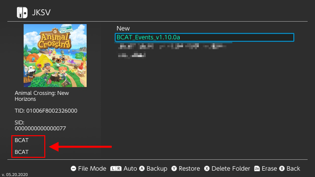
7. Then select the BCAT that you have downloaded before and press **Y**-Button to restore it.  
   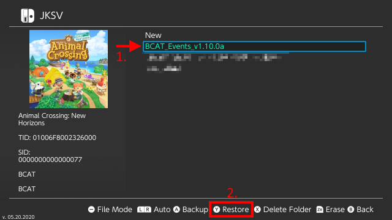
8. Check again, that you're in BCAT section and restoring the right BCAT dump. Press **A** to confirm.  
   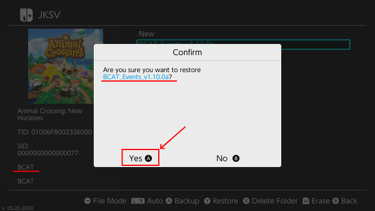
9.  As soon the "Confirm" dialog is gone, the injection is done.  
    Continue with the next step.

### 4. Sync time with switch-time homebrew
Now the last but not least step is to set the time sync flag with the [switch-time](https://github.com/3096/switch-time/releases) homebrew.

1. Open Switch's **System Settings**, navigate to the bottom, select `System`->`Date and Time`.  
   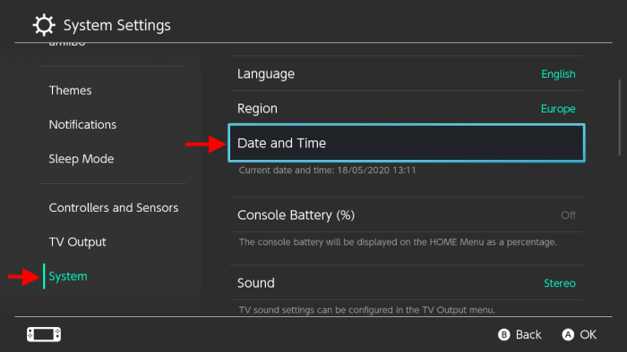
2. Make sure that `Synchronise Clock via Internet` is `On` and press **A** to confirm.  
   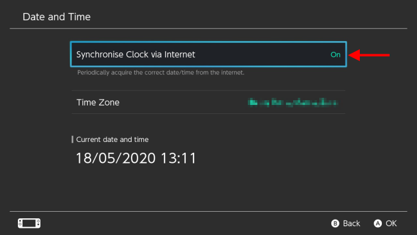
3. Navigate back to the Home menu, enter the hbmenu and start the **switch-time** homebrew.  
   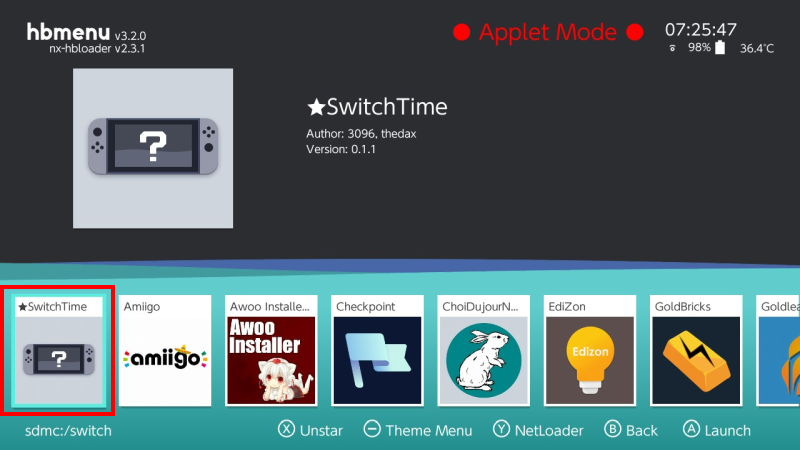
4. In the SwitchTime you can set the time however you like and if you're done with your changes, just press the **A**-Button to confirm.  
   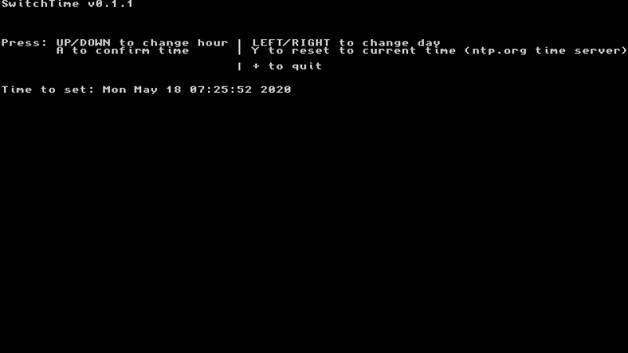  
5. `Successfully set NetworkSystemClock`, if you see this message, anything worked correct, if not try again.  
   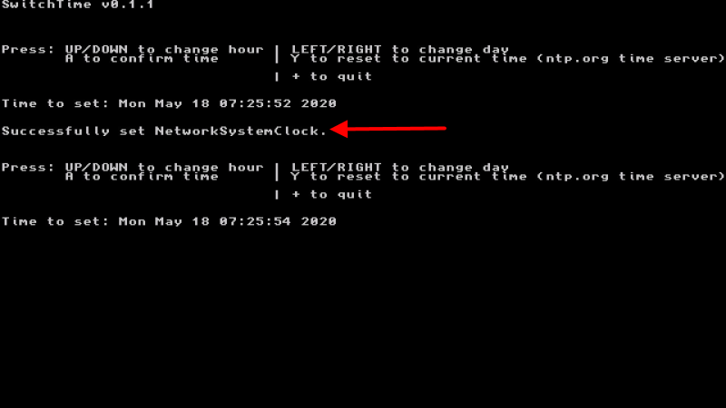  
6. We are done here, close the Homebrew by pressing "+" or just press the "Home" button.

### 5. Profit
If you have followed the guide, at this point you're ready to start the game and verify that the Event is activate for you.  
**Attention!** All special events are time limited, that means that the activation will only work, if the Switch time is set to the time of the event.  
For example: You can activate and play the International Museum Day event only between 18th and 31st May.  
You can find more information about special event on the internet.  

Now let start the game and see if you made anything right.  
You should see a letter behind the Version number, this latter depends on the event.  
e.g. June Bride event, in June 2021 it should show 1.10.0 **a**  
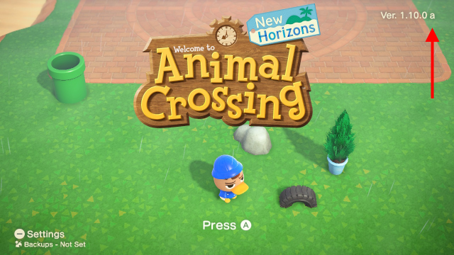  
Have fun playing!

## FAQ

### Do I need my own passphrase.bin?  
No, you don't need to do anything with the **passphrase.bin** as long you're using my release!  
If you restore only the *directories* folder, your passphrase.bin will be deleted and automatically recreated on the next start of the game.

## Credits
Name | Reason
---- | ---------
Igromanru | This guide and latest BCAT files for International Museum Day and Wedding Season
Eevee | Dumped May Day BCAT 
Alree | Latest v1.6-v1.10 BCATs
